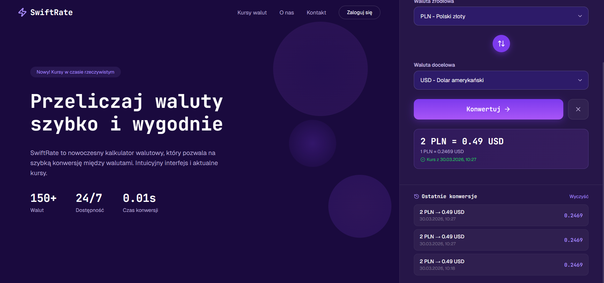

# SwiftRate — Kalkulator Walutowy

Kalkulator walutowy oparty na oficjalnych kursach Europejskiego Banku Centralnego. Dane pobierane przez [Frankfurter API](https://www.frankfurter.app/).

App is [live on Vercel](https://swift-rate-app.vercel.app/).



## Funkcje

- Przeliczanie kwot między 31 walutami EBC
- Nazwy walut w języku polskim
- Podgląd kursu jednostkowego w czasie rzeczywistym (bez klikania "Konwertuj")
- Historia ostatnich 10 konwersji w sesji
- Aktualne kursy 4 popularnych par walutowych (USD/PLN, EUR/PLN, GBP/PLN, USD/EUR)
- Zamiana walut miejscami jednym przyciskiem
- Enter key support w polu kwoty

## Dane kursowe

Kursy pochodzą z Europejskiego Banku Centralnego i są aktualizowane każdego dnia roboczego (pon.–pt., z wyłączeniem dni wolnych EBC). W weekendy i święta API zwraca ostatni dostępny kurs.

## Stack

- **React 19** + **Vite 8** (JSX, bez TypeScript)
- **CSS Modules** — każdy komponent ma własny plik `.module.css`
- **lucide-react** — ikony
- [Frankfurter API](https://www.frankfurter.app/) — bezpłatne API kursów EBC, bez klucza API
- Wdrożenie: **Vercel** (proxy do Frankfurter skonfigurowany w `vercel.json`)

## Uruchomienie lokalne

```bash
npm install
npm run dev
```

Proxy Vite (`/api/frankfurter → https://api.frankfurter.app`) jest skonfigurowane w `vite.config.js` — żadne zmienne środowiskowe nie są potrzebne.

## Komendy

| Komenda | Opis |
|---|---|
| `npm run dev` | Serwer developerski z HMR |
| `npm run build` | Build produkcyjny → `dist/` |
| `npm run preview` | Podgląd builda produkcyjnego |
| `npm run lint` | ESLint (flat config v9) |

## Wdrożenie

Gotowe do wdrożenia na Vercel. Plik `vercel.json` zawiera rewrite przekierowujący `/api/frankfurter/*` do `https://api.frankfurter.app/*`, co omija ograniczenia CORS w przeglądarce.

## Responsywność

- **Desktop** (≥ 1200px) — dwie kolumny: hero po lewej, panel konwertera po prawej
- **Tablet** (769px – 1199px) — hero na górze, konwerter jako karta poniżej
- **Mobile** (≤ 768px) — pełna szerokość, uproszczony hero

## Struktura projektu

```
src/
├── api/
│   └── frankfurter.js       # fetchRate(), fetchCurrencies()
├── components/
│   ├── Converter/            # Formularz konwersji
│   ├── HeroSide/             # Lewa kolumna z opisem
│   ├── HistorySection/       # Historia i popularne kursy
│   └── Navbar/               # Logo
├── hooks/
│   └── useRates.js           # Kurs jednostkowy w czasie rzeczywistym
├── services/
│   └── currencyService.js    # Przeliczenie kwoty (amount × rate)
├── utils/
│   ├── currencyNames.js      # Polskie nazwy walut
│   └── format.js             # Formatowanie daty DD.MM.YYYY
└── App.jsx                   # Główny komponent, cały stan aplikacji
```
